Â# SFND 2D Feature Tracking


The idea of the camera course is to build a collision detection system - that's the overall goal for the Final Project. As a preparation for this, you will now build the feature tracking part and test various detector / descriptor combinations to see which ones perform best. This mid-term project consists of four parts:

* First, you will focus on loading images, setting up data structures and putting everything into a ring buffer to optimize memory load.
* Then, you will integrate several keypoint detectors such as HARRIS, FAST, BRISK and SIFT and compare them with regard to number of keypoints and speed.
* In the next part, you will then focus on descriptor extraction and matching using brute force and also the FLANN approach we discussed in the previous lesson.
* In the last part, once the code framework is complete, you will test the various algorithms in different combinations and compare them with regard to some performance measures.

See the classroom instruction and code comments for more details on each of these parts. Once you are finished with this project, the keypoint matching part will be set up and you can proceed to the next lesson, where the focus is on integrating Lidar points and on object detection using deep-learning.

## Dependencies for Running Locally
* cmake >= 2.8
  * All OSes: [click here for installation instructions](https://cmake.org/install/)
* make >= 4.1 (Linux, Mac), 3.81 (Windows)
  * Linux: make is installed by default on most Linux distros
  * Mac: [install Xcode command line tools to get make](https://developer.apple.com/xcode/features/)
  * Windows: [Click here for installation instructions](http://gnuwin32.sourceforge.net/packages/make.htm)
* OpenCV >= 4.1
  * This must be compiled from source using the `-D OPENCV_ENABLE_NONFREE=ON` cmake flag for testing the SIFT and SURF detectors.
  * The OpenCV 4.1.0 source code can be found [here](https://github.com/opencv/opencv/tree/4.1.0)
* gcc/g++ >= 5.4
  * Linux: gcc / g++ is installed by default on most Linux distros
  * Mac: same deal as make - [install Xcode command line tools](https://developer.apple.com/xcode/features/)
  * Windows: recommend using [MinGW](http://www.mingw.org/)

## Basic Build Instructions

1. Clone this repo.
2. Make a build directory in the top level directory: `mkdir build && cd build`
3. Compile: `cmake .. && make`
4. Run it: `./2D_feature_tracking`.


##  Detectors & Descriptors
* **Detectors**: An interest point detector is an algorithm that chooses points from an image based on some criterion. Typically, an interest point is a local maximum of some function, such as a "cornerness" metric.

* **Descriptors**: A descriptor is a vector of values that describe the image patch around an interest point, like raw pixel values, histogram of gradients (HoG), etc.


##  Haris Corner Detector

<a href="http://www.bmva.org/bmvc/1988/avc-88-023.pdf">Original Paper</a>


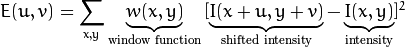

Taylor Series:   

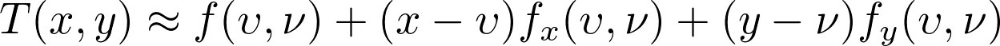


Rewriting the shifted intensity using the above formula:

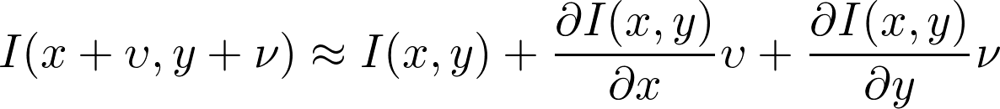


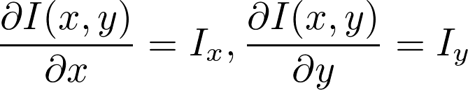

(Image derivatives in the X and Y direction respectively)

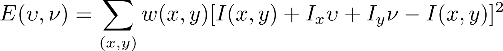

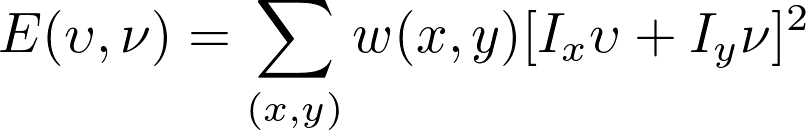

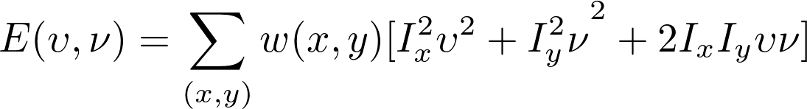

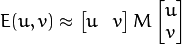


Where

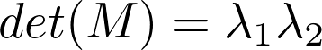

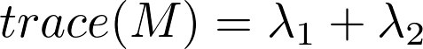

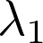
and 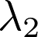 are eigenvalues of M, k is an empirical constant with value between 0.04-0.06

### C++ Code
```c++
// load image from file
cv::Mat img;
img = cv::imread("../images/img1.png");
cv::cvtColor(img, img, cv::COLOR_BGR2GRAY); // convert to grayscale

// Detector parameters
int blockSize = 2;     // for every pixel, a blockSize × blockSize neighborhood is considered
int apertureSize = 3;  // aperture parameter for Sobel operator (must be odd)
int minResponse = 100; // minimum value for a corner in the 8bit scaled response matrix
double k = 0.04;       // Harris parameter

// Detect Harris corners and normalize output
cv::Mat dst, dst_norm, dst_norm_scaled;
dst = cv::Mat::zeros(img.size(), CV_32FC1);
cv::cornerHarris(img, dst, blockSize, apertureSize, k, cv::BORDER_DEFAULT);
cv::normalize(dst, dst_norm, 0, 255, cv::NORM_MINMAX, CV_32FC1, cv::Mat());
cv::convertScaleAbs(dst_norm, dst_norm_scaled);

// visualize results
string windowName = "Harris Corner Detector Response Matrix";
cv::namedWindow(windowName, 4);
cv::imshow(windowName, dst_norm_scaled);
cv::waitKey(0);

// Look for prominent corners and instantiate keypoints
vector<cv::KeyPoint> keypoints;
double maxOverlap = 0.0; // max. permissible overlap between two features in %, used during non-maxima suppression
for (size_t j = 0; j < dst_norm.rows; j++)
{
    for (size_t i = 0; i < dst_norm.cols; i++)
    {
        int response = (int)dst_norm.at<float>(j, i);
        if (response > minResponse)
        { // only store points above a threshold

            cv::KeyPoint newKeyPoint;
            newKeyPoint.pt = cv::Point2f(i, j);
            newKeyPoint.size = 2 * apertureSize;
            newKeyPoint.response = response;

            // perform non-maximum suppression (NMS) in local neighbourhood around new key point
            bool bOverlap = false;
            for (auto it = keypoints.begin(); it != keypoints.end(); ++it)
            {
                double kptOverlap = cv::KeyPoint::overlap(newKeyPoint, *it);
                if (kptOverlap > maxOverlap)
                {
                    bOverlap = true;
                    if (newKeyPoint.response > (*it).response)
                    {                      // if overlap is >t AND response is higher for new kpt
                        *it = newKeyPoint; // replace old key point with new one
                        break;             // quit loop over keypoints
                    }
                }
            }
            if (!bOverlap)
            {                                     // only add new key point if no overlap has been found in previous NMS
                keypoints.push_back(newKeyPoint); // store new keypoint in dynamic list
            }
        }
    } // eof loop over cols
}     // eof loop over rows
```


grayscale image

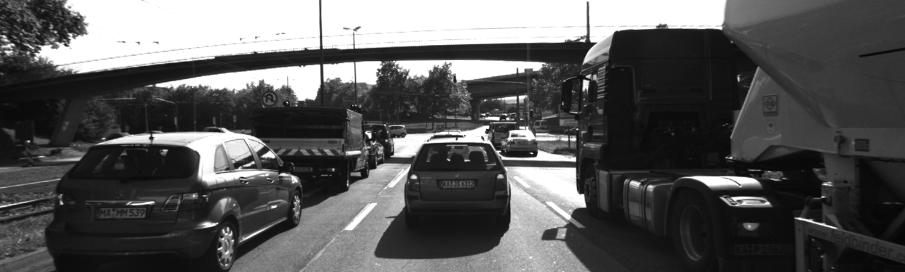

after applying Harris

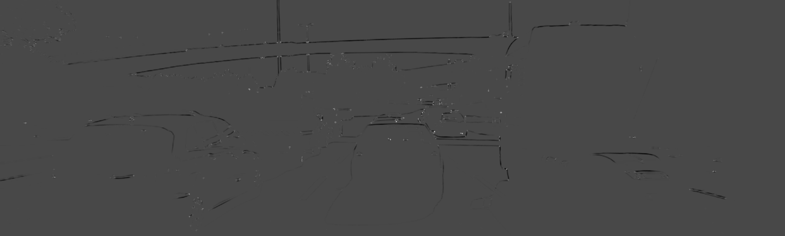

after applying non-maximum suppression

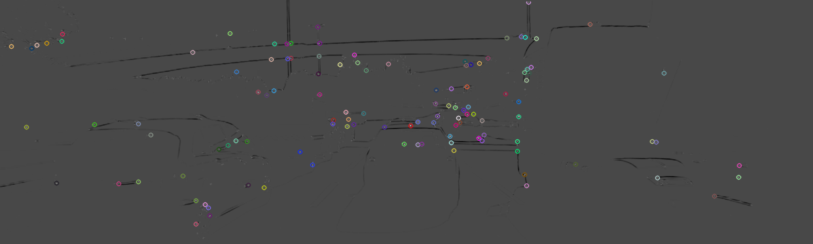


##  Shi-Tomasi Corner Detector
<a href="http://www.ai.mit.edu/courses/6.891/handouts/shi94good.pdf">Original Paper</a>

The scoring function in Harris Corner Detector is:


The scoring function in Shi-Tomasi Corner Detector is:

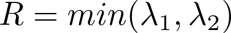

### C++ Code


```c++
cv::Mat imgGray;
cv::Mat img = cv::imread("../images/img1.png");
cv::cvtColor(img, imgGray, cv::COLOR_BGR2GRAY);

// Shi-Tomasi detector
int blockSize = 6;       //  size of a block for computing a derivative covariation matrix over each pixel neighborhood
double maxOverlap = 0.0; // max. permissible overlap between two features in %
double minDistance = (1.0 - maxOverlap) * blockSize;
int maxCorners = img.rows * img.cols / max(1.0, minDistance); // max. num. of keypoints
double qualityLevel = 0.01;                                   // minimal accepted quality of image corners
double k = 0.04;
bool useHarris = false;

vector<cv::KeyPoint> kptsShiTomasi;
vector<cv::Point2f> corners;
double t = (double)cv::getTickCount();
cv::goodFeaturesToTrack(imgGray, corners, maxCorners, qualityLevel, minDistance, cv::Mat(), blockSize, useHarris, k);

for (auto it = corners.begin(); it != corners.end(); ++it)
{ // add corners to result vector
    cv::KeyPoint newKeyPoint;
    newKeyPoint.pt = cv::Point2f((*it).x, (*it).y);
    newKeyPoint.size = blockSize;
    kptsShiTomasi.push_back(newKeyPoint);
}

// visualize results
cv::Mat visImage = img.clone();
cv::drawKeypoints(img, kptsShiTomasi, visImage, cv::Scalar::all(-1), cv::DrawMatchesFlags::DRAW_RICH_KEYPOINTS);
string windowName = "Shi-Tomasi Results";
cv::namedWindow(windowName, 1);
imshow(windowName, visImage);
cv::waitKey(0);
```


## FAST Corner Detector
(Features from Accelerated Segment Test)

<a href="https://www.edwardrosten.com/work/rosten_2006_machine.pdf">Original Paper</a>

* Select pixel p with intensity 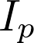
* Select appropriate threshold value t
* Consider a circle of 16 pixels around the pixel under test


* The pixel p isa corner if there exists a set of n contiguous pixels in the circle of 16 pixles which are all brigher than   + t, or all darker than   - t

* A high-speed test was proposed to exclude a large number of non-corners. This test examines four pixels at 1, 9, 5 and 13. (First 1 and 9 are tested if they are too brighter or darker. If so, then checks 5 and 13) If p is a corner, then at least three of these must all be brighter than   + t or darker than   − t. If neither of these is the case, then p cannot be a corner. The full segment test criterion can then be applied to the passed candidates by examining all pixels in the circle. This detector in itself exhibits high performance, but there are several weaknesses:

  * It does not reject as many candidates for n < 12.
  * The choice of pixels is not optimal because its efficiency depends on ordering of the questions and distribution of corner appearances.
  * Results of high-speed tests are thrown away.
  * Multiple features are detected adjacent to one another.

First 3 points are addressed with a machine learning approach. Last one is addressed using non-maximal suppression.


## Patch Descriptors

## SIFT Descriptor

## SURF Descriptor

## Binary Descriptors
A binary descriptor is composed of three parts:
* **A sampling pattern**: where to sample points in the region around descriptor
* **Orientation compensation**: some mechanism to measure the orientation of the keypoint and rotate it to compensate for rotation changes  
* **Sampling pairs**: which pairs to compare when building the final descriptor

|               | Sampling Pattern | Orientation Calculation| Sampling Pair
| ------------- | ------------- |----------------|-----------|
| **BRIEF** | None  | None| Random|
| **ORB**   | None  | Moments| Learned Pairs|
| **BRISK** | 	Concentric circles with more points on outer rings  | Comparing gradients of long pairs | Using only short pairs|
| **FREAK** |  	Overlapping Concentric circles with more points on inner rings | Comparing gradients of preselected 45 pairs.| Learned pairs.|


<a href="https://gilscvblog.com/2013/11/08/a-tutorial-on-binary-descriptors-part-4-the-brisk-descriptor/">Reference</a>
## BRIEF Descriptor
<a href="https://www.cs.ubc.ca/~lowe/525/papers/calonder_eccv10.pdf">Original Paper</a>

BRIEF takes only information at single pixel location to build descriptor, so Gaussian filter is used to make it less sensitive to noise. BRIEF does not have a sampling pattern so pairs can be chosen at any point on the patch. To build a descriptor of length n, we need n pairs (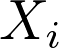,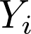). Let X, Y be vectors of point  and , respectively

Here are five methods to determine pixel point:
* X, Y are randomly uniformly sampled
* X, Y are randomly sampled using a Gaussia distribution (locations closer to the center pf the patch are preferred)
* X, Y are randomly sampled using a Gaussian distribution where first X is sampled with a standard deviation of 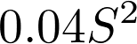and then 's are sampled using a Gaussian distribution (each  is sampled with mean  and standard devisiont of 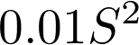)
* X and Y are randomly sampled from discrete location of a coarse polar grid
* For each i,  is (0,0) and  takes all possible values on a coarse polar grid

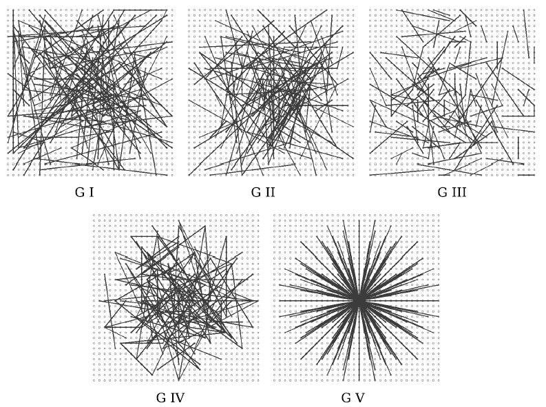

<br/>
<br/>
<br/>

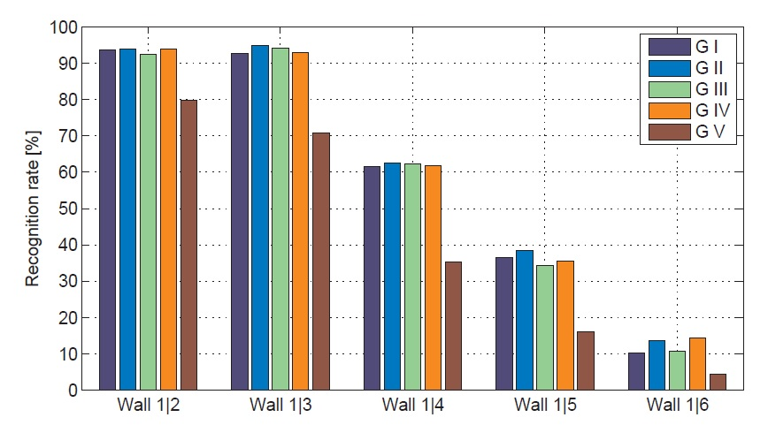

## ORB Descriptor

Two main differences between BRIEF and ORB:
* ORB uses an orientation compensation mechanism, making it rotation invariant
* ORB learns the optimal sampling pairs, whereas BRIEF uses randomly chosen sampling pairs


### Orientation Compensation
ORB uses intensity centroid as a measrue of corner orientation.
The **moments** of a patch are defined as:

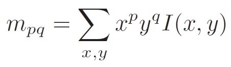

<br/>
<br/>
Then centroid (center of mass) of the patch is
<br/>

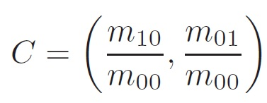
<br/>
<br/>
The orientation of the patch is
<br/>
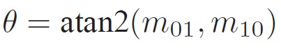
<br/>
<br/>
Illustration
<br/>
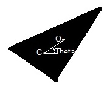


Once we have calculated the orientation of the patch, we can rotate it to a canonical rotation and then compute the descriptor, thus obtaining some rotation invariance.

### Learning Sampling Pairs
We want our sampling pairs to have two properties:
* uncorrelation: so that each new pair will bring new information to the descriptor, to maximize the amount of information the descriptor carries
* high variance of pairs: to make a feature more discriminative


There are about 205,000 possible tests (sampling pairs) to consider. However, only 256 tests will be chosen.

The learning is done as follows:
* First set a training set of about 300,000 keypoints drawn from the PASCAL 2006 dataset
* Second apply the following greedy algorithm:
    * run each test against all training pathces
    * order the tests by their distance from a mean of 0.5, forming vector T
    * greedy search
        * put the first test into the result vector R and remove it from T
        * take the next test from T and compare it against all tess in R. If its absolute correlation is greater than a threshold, discard it, otherwise, add it to R
        * Repeat the previous step until there are 256 tests in R. If there are less than 256 tests raise the threshold and try again

In the end, we will have a set of 256 relatively uncorrelated tests with high variance.

in non-geometric transformation (those that are image capture dependent and do not rely on the viewpoint, such as blur, JPEG compression, exposure and illumination) BRIEF actually outperforms ORB. In affine transformation, BRIEF perform poorly under large rotation or scale change as it’s not designed to handle such changes. In perspective transformations, which are the result of view-point change, BRIEF surprisingly slightly outperforms ORB.

<a href="https://gilscvblog.com/2013/10/04/a-tutorial-on-binary-descriptors-part-3-the-orb-descriptor/">Reference</a>
## BRISK Descriptor
<a href="http://margaritachli.com/papers/ICCV2011paper.pdf">Original Paper</a>

The BRISK descriptor is different from BRIEF and ORB by having a hand=crafted sampling pattern.

When considering each sampling point, we take a small pathch around it and apply Gaussian smoothing. The red circle illustrates the size of the standard deviation of the Gaussian filter applied to each sampling point.

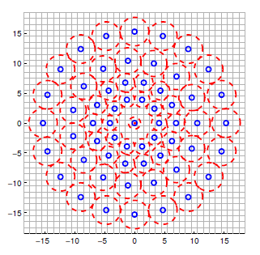

### Short and long distance pairs:
Short pairs are pairs of sampling points that the distance is below a certain threshold 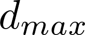. Short pairs are used for the intensity comparisons that build the descriptor.

Long pairs are pairs of sampling points that the distance is above a certain threshold 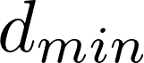. Long pairs are used to determine orientation.

( >  so there are no short pairs that are also long pairs)

<a href="https://gilscvblog.com/2013/11/08/a-tutorial-on-binary-descriptors-part-4-the-brisk-descriptor/">Reference</a>

## FREAK Descriptor
<a href="https://infoscience.epfl.ch/record/175537/files/2069.pdf">Original Paper</a>

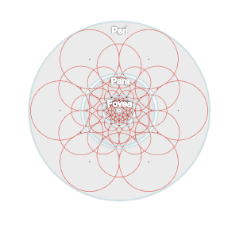

<br/>
<br/>
<br/>
<br/>
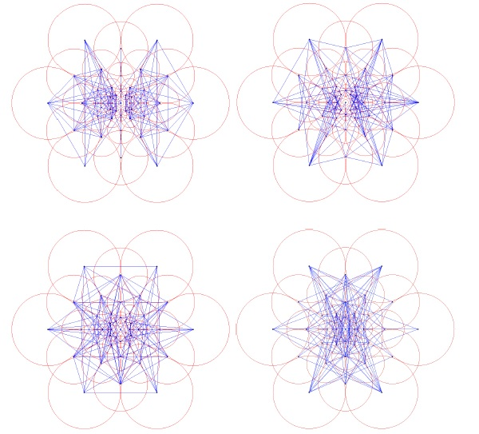

<a href="https://gilscvblog.com/2013/12/09/a-tutorial-on-binary-descriptors-part-5-the-freak-descriptor/">Reference</a>
